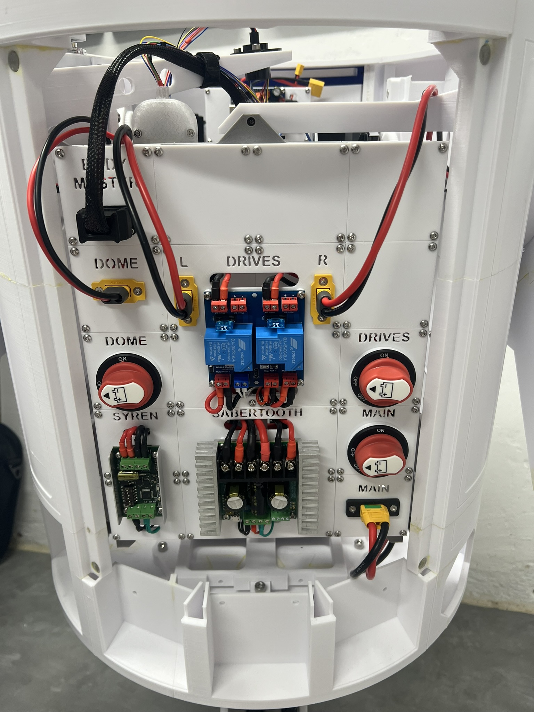
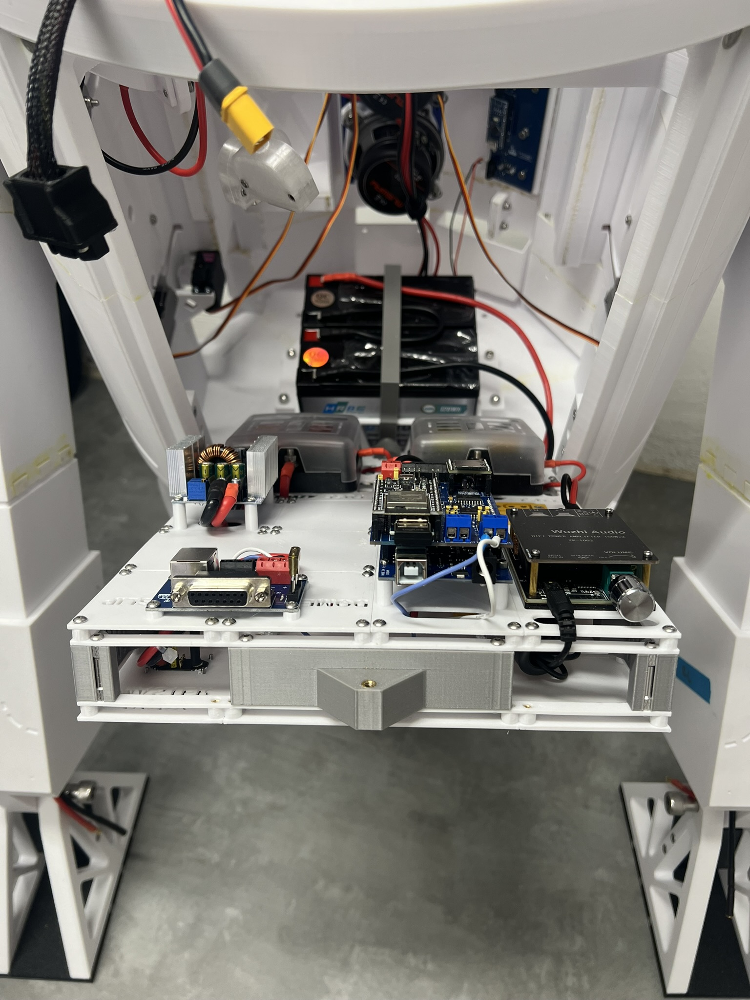
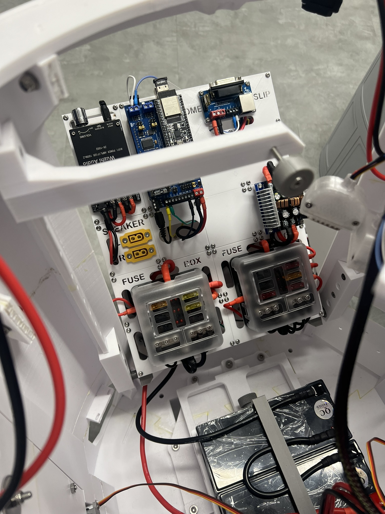
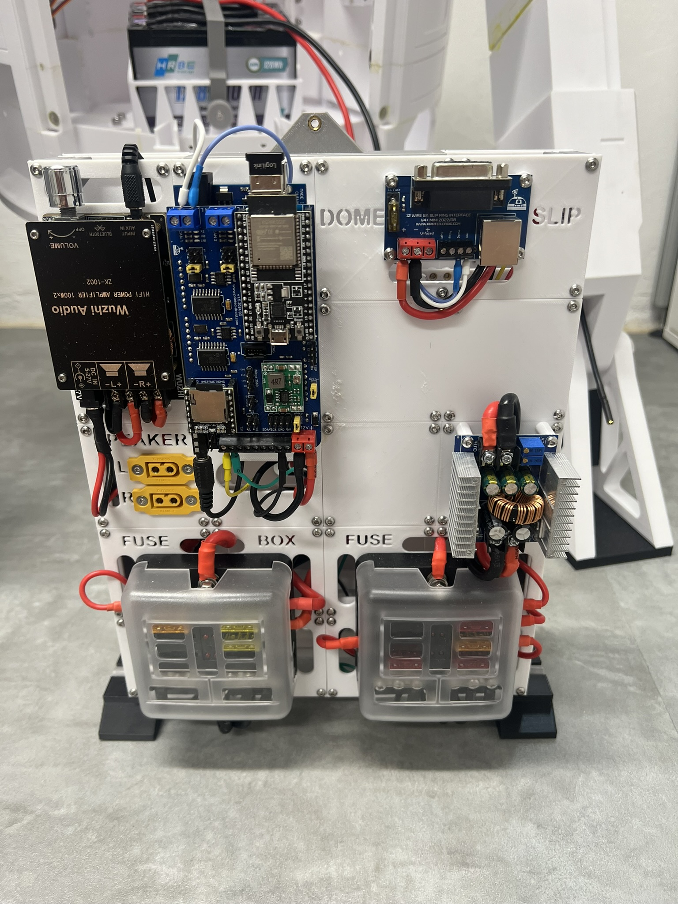
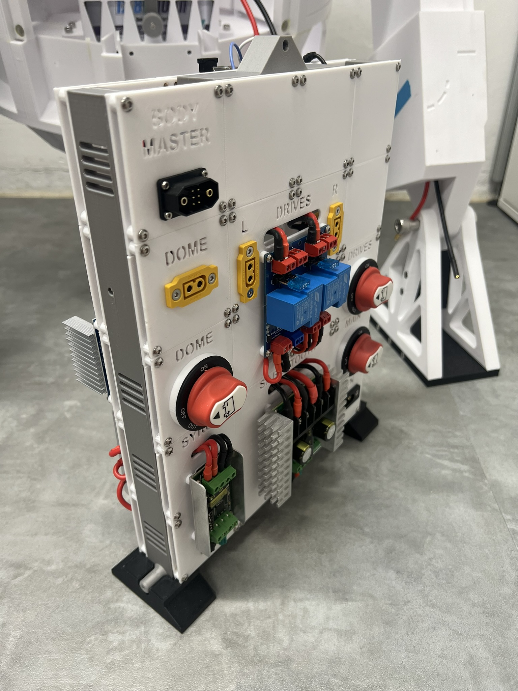

# R2D2 Modular control unit (MCU)

## General motivation
- There are many good solutions for organizing all the control electronics for the whole selection of R2D2 bodys.
- However, none of these solutions fully met my requirements, so I designed my own interpretation of a modular control unit `the brain`.
  - Special thanks to everyone who inspired me, particularly John van Ohrs with his [R2D2 modular electronics panel by jfmvoers - Thingiverse](https://www.thingiverse.com/thing:6580609) and Tim Eebel with his [MarkIII Hinged Electronics Panel](https://www.printables.com/model/614178-markiii-hinged-electronics-panel).

## Requirements
- The module must be completely removable as a single unit to allow work on it at the workbench.
  - Everything must be possible without any special tools, i.e., plug-and-play instead of screws (almost achieved)!
- To allow access when installed, the entire unit must be hinged (no tools required for this step).
- The design must be modular, allowing it to be adapted to specific requirements.
- The design must be based on a grid (60x60mm) and offers panels ranging from `1x1` to `NxN`.

## Used Mods & Kudos

<blockquote class="callout note">
💡 <strong>NOTE:</strong> The following list contains an overview of the mods that I currently use in my Droid. It is not mandatory to use them as well, but I can confirm that they are compatible with each other.
</blockquote>

- [Battery Tray for Baddeley MKIII Astromech](https://www.printables.com/de/model/192002-battery-tray-for-baddeley-mkiii-astromech) by [Jason Charlton | Printables.com](https://www.printables.com/de/@JasonCharlton_264357) (he also has many other great mods!)
- Dome Motor Mount by [Gonz Pousada J Luis](https://www.facebook.com/groups/MrBaddeley/posts/3683034678691760/).
- Both Luis and Jason have other fantastic mods, and you should also check out [Jason's YouTube Channel](https://www.youtube.com/@jasonsR2D2).
- A special thanks to Ben from [Printed Droid](https://printed-droid.com), who provided me with the electronic components, and to Norbert A. Richartz, who is developing the AstroCan System and [BetterDuinoFirmwareV4](https://github.com/RealNobser/BetterDuinoFirmwareV4). He answered nearly all my questions and integrated some cool features.

## Images
</img> </img> </img> </img> </img>

## Community panels

<blockquote class="callout tip">
🛠 <strong>TIP:</strong> The following link contains an overview of panels which were created by other users to extend the option what electronics can be used. Thank you so much!
</blockquote>

[R2-D2 MCU-Panel-Collection](https://makerworld.com/de/collections/5528180-r2-d2-mcu-panel-collection)