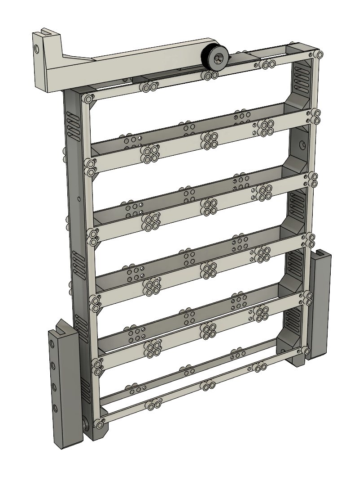

# Documentation

## Table of content

### General description an requirements

- All files have numbers at the end `d1x1` means that the panel has a size of 60x60mm, the number at the end marks if there is more then one piece needed.
- The panels only have the size at the end because the quantity depends on your setup.

### Overview of the design

#### Frame

</img>

#### Panels

TBA!

### Parts list

| Part                         | Quantity | Used for                                                                                          |
| ---------------------------- | -------- | ------------------------------------------------------------------------------------------------- |
| M2x10 mm Cylinder head screw | 4        | Attaching amplifier to printed panel                                                              |
| M3x6 mm Cylinder head screw  | 4        | Attaching the Arduino Mega2560 + AstroCan Shield to printed panel                                 |
| M3x6 mm Pan head screw       | 80       | Connecting the front and back frame to the standoffs                                              |
| M3x10 Countersunk screw      | 12       | Attaching the XT60 & XT90 to the adapters                                                         |
| M4x18 Countersunk screw      | 4        | Connecting the ``Body-Adapter-Left-Bottom.stl`` and ``Body-Adapter-Right-Bottom.stl`` to the body |
| M4x40 Countersunk screw      | 1        | ``Body-Adapter-Top-Knob.stl`` to secure the MCU in the body                                       |
| M4 Square nut                | 1        | ``Body-Adapter-Top-Knob.stl`` to secure the MCU in the body                                       |
| M3 Locknut                   | 12       | Attaching the XT60 & XT90 to the adapters                                                         |
| M3x5.7 mm Threaded inserts   |          |                                                                                                   |
| M4x4x6 mm Threaded inserts   | 4        | Connecting the ``Body-Adapter-Left-Bottom.stl`` and ``Body-Adapter-Right-Bottom.stl`` to the body |
| M3 Standoffs                 | 40       | Connecting the front and back frame                                                               |
| 15x10x4 mm Bearing           | 4        | Two each for the ``Body-Adapter-Left-Bottom.stl`` and ``Body-Adapter-Right-Bottom.stl``           |
| Power rails                  | 4        | Not used, but there are STLs if needed                                                            |
| Step-down LCD                | 2        | Power supply for 5V                                                                               |
| 12V 20A Buck converter       | 1        | Power supply for 12V                                                                              |
| XT60                         |          |                                                                                                   |
| XT90                         |          | Main power connection of the batteries                                                            |
| MPX-like connector           |          | To have a power connection with 6 data lines to the body                                          |
| Powerrails                   | 4        |                                                                                                   |
| Stepdowns LCD                |          |                                                                                                   |
| Buckconverter                |          |                                                                                                   |

### Assembly Instructions Frame

#### Required Parts:
- **15x10x4 mm bearings (4 pieces)**
- **M4x4x6 mm threaded inserts (8 pieces)**
- **M3x18 mm countersunk screws (5 pieces)**
- **M3x6 mm pan head screws (80 pieces)**
- **M4 square nut (1 piece)**
- **M4x40 mm countersunk screw (1 piece)**
- **Standoffs (40 pieces)**

The assembly is relatively simple, as the entire "package" is stable once it has been assembled.

##### 1. Preparation of the Body Adapters
1. **Body-Adapter-Left-Bottom.stl** and **Body-Adapter-Right-Bottom.stl**:
   1. Press in **two 15x10x4 mm bearings** each.
   2. Melt in **two M4x4x6 mm threaded inserts** each.
   3. Attach to the body using **two M3x18 mm countersunk screws** each, ensuring that the bottom edge of the adapters aligns with the mounting points on the body.
   4. **Optional**: If necessary, two additional screws and threaded inserts can be installed on each side.

##### 2. Preparation of the Frame
> **Note:**  
> - If the build volume is larger than that of a Bambu Lab X1C, `Frame-Complete_x2.stl` can be printed twice.
> - If the build volume is smaller than that of a Bambu Lab X1C, `Frame-Modular-End_x4.stl` must be printed four times and `Frame-Modular-Middle_x6.stl` six times.

1. Melt in **80 M3x5.7 mm threaded inserts** per side (fewer inserts may be used depending on how the modules are arranged).

##### 3. Frame Assembly
1. Attach the **40 standoffs** to one side of the frame using **40 M3x6 mm pan head screws**.
2. Slide the parts `Frame-Connector-Left.stl`, `Frame-Connector-Right.stl`, and `Frame-Connector-Top.stl` over the standoffs.
3. Finally, attach the remaining side to the standoffs using **40 M3x6 mm pan head screws**.

##### 4. Assembly of the Screwable Body Adapter
1. **Body-Adapter-Left-Top.stl** and **Body-Adapter-Top-Knob.stl**:
   1. Melt in **two M4x4x6 mm threaded inserts**.
   2. Attach to the body using **one M3x18 mm countersunk screw**, ensuring that the top edge of the adapter aligns with the mounting point on the body.
   3. Assemble the hand-tightened knob using **one M4 square nut** and **one M4x40 mm countersunk screw**.

#### Assembly on the Body
##### Required Parts:
- **M4x18 mm countersunk screws (4 pieces)**: To attach the Body-Adapter-Left-Bottom.stl and Body-Adapter-Right-Bottom.stl to the body.
- **M4x40 mm countersunk screw (1 piece)**: To secure the MCU in the body with a screwable knob.
- **M4 square nut (1 piece)**: To secure the MCU in the body with a screwable knob.
- **M4x4x6 mm threaded inserts (4 pieces)**: To connect the Body-Adapter-Left-Bottom.stl and Body-Adapter-Right-Bottom.stl to the body.
- **15x10x4 mm bearings (4 pieces)**: Two each for the Body-Adapter-Left-Bottom.stl and Body-Adapter-Right-Bottom.stl.

##### Assembly Instructions:
1. **Attach Body-Adapter-Right-Bottom.stl**:
   - Screw the right adapter with the 15x10x4 mm bearings and attach it to the body.

2. **Insert the MCU**:
   - Insert the MCU into the left adapter (Body-Adapter-Left-Bottom.stl).

3. **Mount Body-Adapter-Right-Bottom.stl**:
   - Place the Body-Adapter-Right-Bottom.stl onto the MCU.

4. **Secure Adapter to the Body**:
   - Slide the right adapter onto the body, tilt slightly, and then tighten the screws.

##### Disassembly:
- Follow the steps in reverse order.
