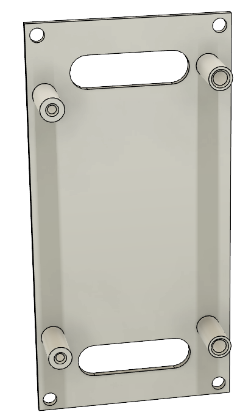
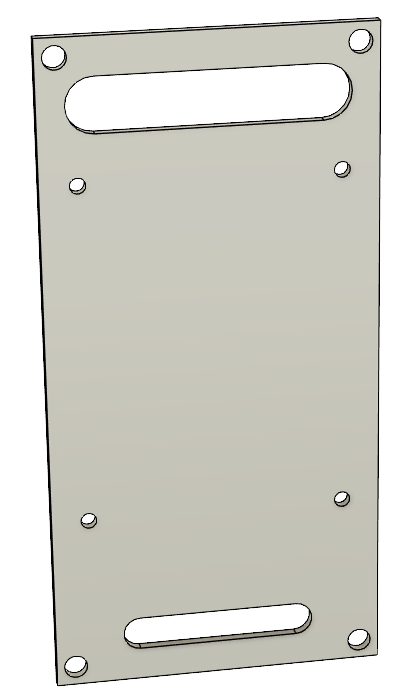
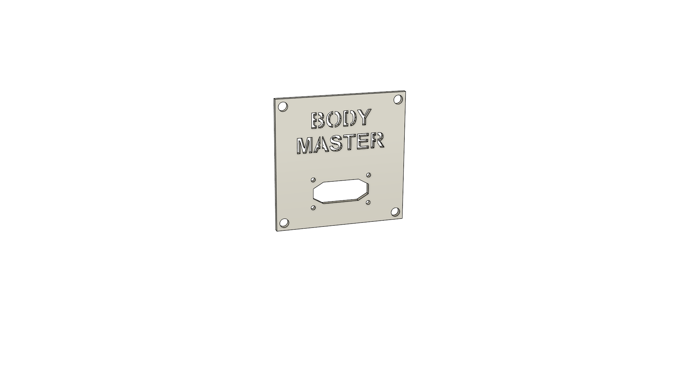
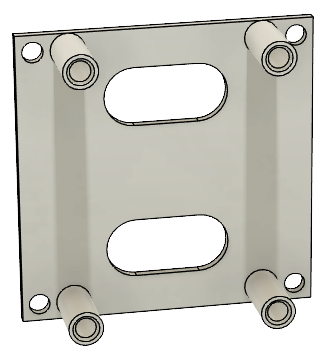
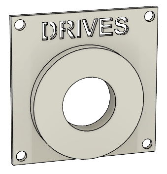
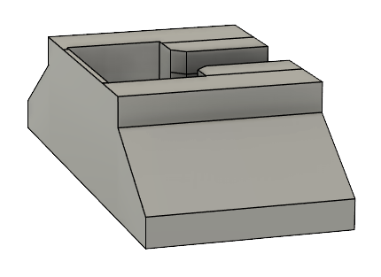

# Table of content
- [Table of content](#table-of-content)
	- [General description and requirements](#general-description-and-requirements)
	- [Overview of the design](#overview-of-the-design)
		- [Frame](#frame)
		- [Panels](#panels)
	- [Parts list](#parts-list)
	- [Assembly Instructions Frame](#assembly-instructions-frame)
		- [Required Parts:](#required-parts)
		- [1. Preparation of the Body Adapters](#1-preparation-of-the-body-adapters)
		- [2. Preparation of the Frame](#2-preparation-of-the-frame)
		- [3. Frame Assembly](#3-frame-assembly)
		- [4. Assembly of the Screwable Body Adapter](#4-assembly-of-the-screwable-body-adapter)
		- [Assembly on the Body](#assembly-on-the-body)
			- [Required Parts:](#required-parts-1)
			- [Assembly Instructions:](#assembly-instructions)
			- [Disassembly:](#disassembly)
		- [Assembly instructions panels](#assembly-instructions-panels)

> [!WARNING]  
> I am not a trained electrician and cannot take any responsibility for any damage or injury that may occur.

## General description and requirements
- All files have numbers at the end `d1x1` means that the panel has a size of 60x60mm.
- The panels only have the size at the end because the quantity depends on your setup.

  
## Overview of the design

### Frame

</img>
</img>
</img>

</img>
</img>
</img>

### Panels

| Name                             | Screenshot |
| -------------------------------- | -------- |
| Panel-AstroCan-Pro-Dual-Shield_d1x2.stl | </img> |
| Panel-Audio_d1x2.stl | </img> |
| Panel-Blank_d1x1.stl| </img> |
| Panel-Blank_d2x1.stl | </img> |
| Panel-Blank-open_d1x1.stl | </img> |
| Panel-Body-Master_d1x1.stl | </img> |
| Panel-Buck-Converter-12v-20A_d1x1.stl | </img> |
| Panel-Dome-50A-Switch_d1x1.stl | </img> |
| Panel-Dome-Slip-Ring-Adapter_d2x1.stl | </img> |
| Panel-Dome-Slip-Ring-Adapter_d2x1.stl | </img> |
| Panel-Dome-XT60_d1x1.stl | </img> |
| Panel-Double-30A-Relay-Board-Drives-XT60-Connectors_d2x2.stl | </img> |
| Panel-Drives-50A-Switch_d1x1.stl | </img> |
| Panel-Fusebox_d2x2.stl | </img> |
| Panel-Main-50A-Switch_d1x1.stl | </img> |
| Panel-Main-XT90_d1x1.stl | </img> |
| Panel-Sabertooth-32A_d2x2.stl | </img> |
| Panel-Speaker-XT60_d1x1.stl | </img> |
| Panel-Syren-10A_d2x1.stl | </img> |
| Stand_x2.stl | </img>

## Parts list

| Part                             | Quantity | Used for                                                                                               | Link |
| -------------------------------- | -------- | ------------------------------------------------------------------------------------------------------ | ---- |
| **M2x10 mm Cylinder Head Screw** | **8**    | Attaching amplifier and MPX-like connector to printed panels                                           |      |
| **M2x10 mm Cylinder Head Screw** | **2**    | Attaching Arduino Mega2560 + AstroCan Shield                                             |      |
| **M3x6 mm Pan Head Screw**       | **104**  | 80 for connecting the front and back frame to the standoffs                                            |      |
|                                  |          | 2 for attaching Arduino Mega2560 + AstroCan Shield                                                     |      |
|                                  |          | 4 for attaching Sabertooth                                                                             |      |
|                                  |          | 4 for attaching Syren                                                                                  |      |
|                                  |          | 4 for attaching Relay board                                                                            |      |
|                                  |          | 4 for attaching Slipring-Adapter-PCB                                                                   |      |
|                                  |          | 4 for attaching 12V 20A buck converter                                                                 |      |
| **M3x10 mm Countersunk Screw**   | **12**   | Attaching the XT60 & XT90 to the adapters                                                              |      |
| **M3x12 mm Countersunk Screw**   | **8**    | Attaching the fuse boxes to printed panels                                                             |      |
| **M3 Locknut**                   | **20**   | 8 for attaching fuse boxes to printed panels                                                           |      |
|                                  |          | 12 for attaching XT60 & XT90 to the adapters                                                           |      |
| **M4x18 mm Countersunk Screw**   | **4**    | Connecting the `Body-Adapter-left.stl` and `Body-Adapter-right.stl` to the body          |      |
| **M4x25 mm Countersunk Screw**   | **2**    | Screwing the `Frame-Adapter-pin-left.stl` and `Frame-Adapter-pin-right.stl` to `Frame-Connector-left.stl` and `Frame-Connector-right.stl`                                                                  |      |
| **M4x40 mm Countersunk Screw**   | **1**    | Securing the MCU in the body using `Body-Adapter-Top-Knob.stl`                                         |      |
| **M4 Square Nut**                | **1**    | Securing the MCU in the body using `Body-Adapter-Top-Knob.stl`                                         |      |
| **M2x3x3.2 mm Threaded Insert**  | **2**    | To attach the AstroCan DualShield to the `Panel-AstroCan-Pro-Dual-Shield_d1x2.stl` panel |
| **M3x5.7 mm Threaded Insert**    | **160**  | To fill all available recordings on the frame (additional inserts may be required based on panel used) |      |
| **M4x4x6 mm Threaded Insert**    | **4**    | Connecting `Body-Adapter-left.stl` and `Body-Adapter-right.stl` to the body              |      |
| **M3 Standoffs**                 | **40**   | Connecting the front- and backframe                                                                    |      |
| **15x10x4 mm Bearings**          | **4**    | Two each for `Body-Adapter-left.stl` and `Body-Adapter-right.stl`                        |      |
| **Step-down LCD**                | **2**    | Power supply for 5V                                                                                    |      |
| **5V 15A Buck Converter**       | **2**    | Power supply for 5V                                                                                   |      |
| **12V 20A Buck Converter**       | **1**    | Power supply for 12V                                                                                   |      |
| **XT60 Connector**               | **5**    | Connection to left and right drive, dome, and speakers                                                 |      |
| **XT90 Connector**               | **1**    | Main power connection of the batteries                                                                 |      |
| **MPX-like Connector**           | **2**    | To provide a power connection with power and up to 6 data lines to the body                                            |      |
| **50V 50A Power Switch**         | **3**    | To switch the dome, drives, and main power                                                             |      |

## Assembly Instructions Frame
> **Note:** 
> - The assembly is relatively simple, as the entire "package/unit" is stable once it has been assembled.

### Required Parts:
- **15x10x4 mm bearings (4 pieces)**
- **M4x4x6 mm threaded inserts (8 pieces)**
- **M3x18 mm countersunk screws (5 pieces)**
- **M3x6 mm pan head screws (80 pieces)**
- **M4 square nut (1 piece)**
- **M4x40 mm countersunk screw (1 piece)**
- **Standoffs (40 pieces)**

### 1. Preparation of the Body Adapters
1. **Body-Adapter-Left-Bottom.stl** and **Body-Adapter-Right-Bottom.stl**:
   1. Press in **two 15x10x4 mm bearings** each.
   2. Melt in **two M4x4x6 mm threaded inserts** each.
   3. Attach to the body using **two M3x18 mm countersunk screws** each, ensuring that the bottom edge of the adapters aligns with the mounting points on the body.
   4. **Optional**: If necessary, two additional screws and threaded inserts can be installed on each side.

### 2. Preparation of the Frame
> **Note:**  
> - If the build volume is larger than that of a Bambu Lab X1C, `Frame-Complete_x2.stl` can be printed twice.
> - If the build volume is smaller than that of a Bambu Lab X1C, `Frame-Modular-End_x4.stl` must be printed four times and `Frame-Modular-Middle_x6.stl` six times.

1. Melt in **80 M3x5.7 mm threaded inserts** per side (fewer inserts may be used depending on how the modules are arranged).

### 3. Frame Assembly
1. Attach the **40 standoffs** to one side of the frame using **40 M3x6 mm pan head screws**.
2. Screw the `Frame-Connector-Left-PIN.stl` and `Frame-Connector-Right-PIN.stl` to the corresponding Frame-Connectors with a **M4x25 mm Countersunk Screw**.
3. Slide the parts `Frame-Connector-Left.stl`, `Frame-Connector-Right.stl`, and `Frame-Connector-Top.stl` over the standoffs.
4. Finally, attach the remaining side to the standoffs using **40 M3x6 mm pan head screws**.

### 4. Assembly of the Screwable Body Adapter
1. ``Body-Adapter-Left-Top.stl`` and ``Body-Adapter-Top-Knob.stl``:
   1. Melt in **one M4x4x6 mm threaded insert**.
   2. Attach to the body using **one M3x18 mm countersunk screw**, ensuring that the top edge of the adapter aligns with the mounting point on the body.
   3. Assemble the hand-tightened knob using **one M4 square nut** and **one M4x40 mm countersunk screw**.

### Assembly on the Body
#### Required Parts:
- **M4x18 mm countersunk screws (4 pieces)**
- **M4x40 mm countersunk screw (1 piece)**
- **M4 square nut (1 piece)**
- **M4x4x6 mm threaded inserts (4 pieces)**
- **15x10x4 mm bearings (4 pieces)**

#### Assembly Instructions:
1. **Attach** ``Body-Adapter-Left-Bottom.stl``:
   - Screw the left adapter with the 15x10x4 mm bearings and attach it to the body.

2. **Insert the MCU**:
   - Insert the MCU into the left adapter (``Body-Adapter-Left-Bottom.stl``).

3. **Mount** ``Body-Adapter-Right-Bottom.stl``:
   - Place the ``Body-Adapter-Right-Bottom.stl`` onto the MCU.

4. **Secure Adapter to the Body**:
   - Slide the right adapter onto the body, tilt slightly, and then tighten the screws.

#### Disassembly:
- Follow the steps in reverse order.

### Assembly instructions panels

- The panels themselves are each attached to the frame with **1-n M3x6 mm pan head screws**.
- In some cases, M3x5.7 mm threaded inserts are also required to attach the parts to the panels themselves.